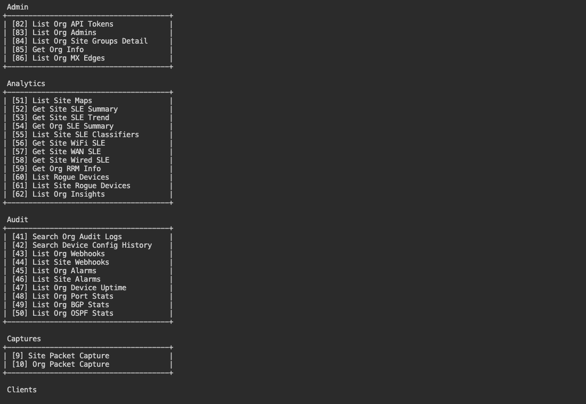
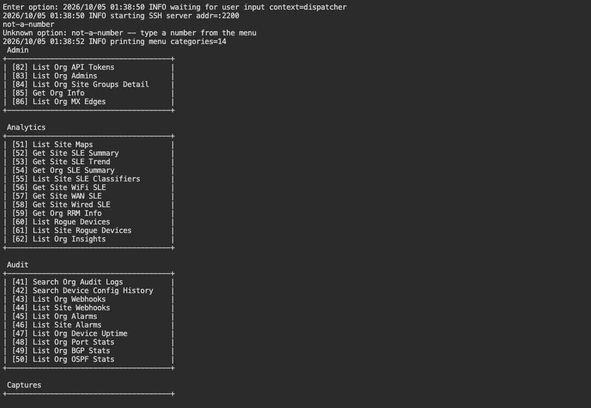
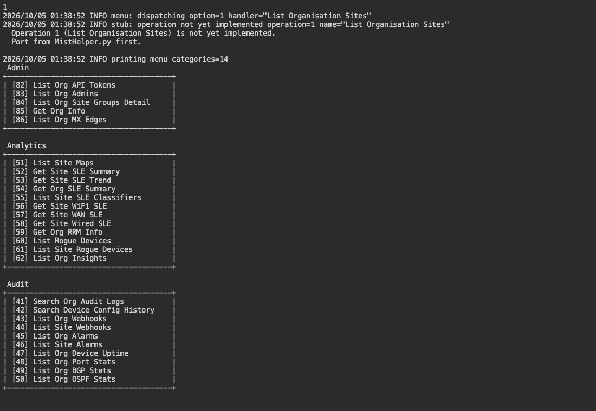

# MistHelper-Go

## What

A container-first Go port of [MistHelper](https://github.com/jmorrison-juniper/MistHelper)
for Juniper Mist Cloud network operations. Read the [current feature status](docs/guide.md#current-status)
before use.

Actual terminal menu, captured offline:

## How

Follow the [container and SSH guide](docs/guide.md#container-start).
For local work, use the [development guide](docs/development.md).
See [screen descriptions and capture steps](docs/interface.md) for these real
user screens.

Unknown input:

An operation that has not been ported:

## Where

Get the container from [GHCR](https://github.com/jmorrison-juniper/MistHelper-Go/pkgs/container/misthelper-go).
Find [ports and output paths](docs/guide.md#access-and-output),
[source layout](docs/development.md#source-layout), and [CI workflows](docs/ci.md)
in the docs.

## When

Use this port for development and testing while work continues.
Read the [operation limits](docs/guide.md#current-status) and
[release history](CHANGELOG.md) before use.
The [Python project](https://github.com/jmorrison-juniper/MistHelper) remains the
production reference.

## Why

The goal is a small container with a single Go executable and feature parity
with Python. See the [goals and Python-first model](docs/development.md#goals-and-development-model).

## Who

For NOC engineers who work with Juniper Mist networks, and contributors who
port tested Python operations. Maintained by
[@jmorrison-juniper](https://github.com/jmorrison-juniper).
See the [support and license guide](docs/guide.md#support-and-license).
